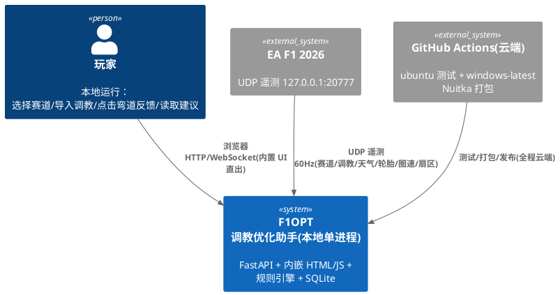
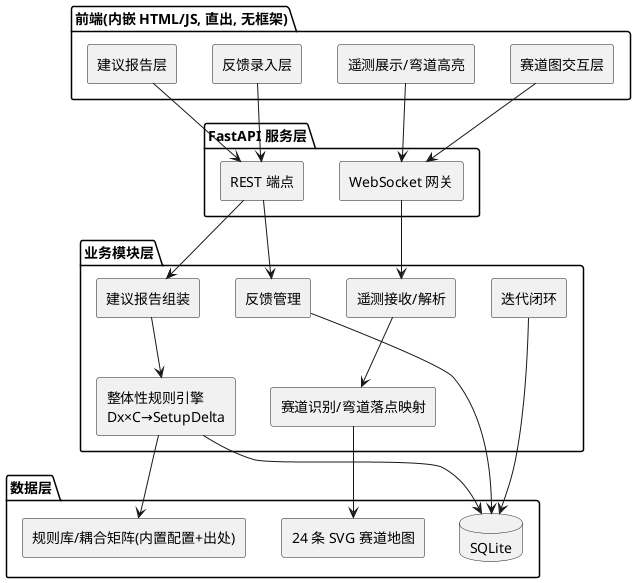
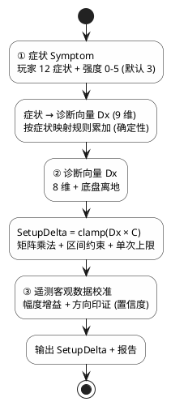
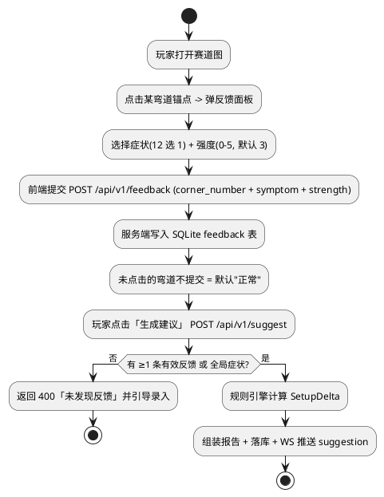

# F1OPT 赛车调教优化助手 —— 技术设计文档

> 文档版本：v1.0
> 文档状态：已生成（待评审确认）
> 特性标识：`setup-tuner`
> 上游需求：`.codeartsdoer/specs/setup-tuner/spec.md`（v1.0，58 条需求）
> 技术栈：Python 3.11（主） + C（可选扩展）；FastAPI + uvicorn；WebSocket；SQLite；Nuitka

---

# 一、需求与存量功能关系分析

本章明确新需求与旧 `legacy/f1opt/` 代码的关系，作为增量设计基础。依据约束 C-06：旧代码逻辑**一律重写**，仅复用「数据/协议定义」与「静态资产」两类可核对资产。

## 1.1 需求功能与存量功能对比

### 1.1.1 已实现功能（可复用数据/协议/资产，逻辑重写）

下表中"复用方式"统一为：**仅核对字段偏移/类型/取值范围，不搬逻辑**。

| 需求功能 | 存量功能 | 代码位置 | 匹配度 | 复用方式 |
|---------|---------|---------|--------|----------|
| UDP 包结构定义（C-04：赛道/调教/天气/轮胎/圈速/扇区） | 17 类 F1 2026 包解析（29B header + 各包 struct 布局） | `legacy/f1opt/telemetry/packets.py:48-693` | 100%（协议核对） | 对照字段偏移/类型，Python `struct` 重写 |
| 调教参数取值范围/步长（FR-PARAM-01/02） | 23 项参数 `SETUP_FIELDS` 注册表（min/max/step/unit） | `legacy/f1opt/data/setup_schema.py:55-105` | 75%（参数集有差异，见 1.1.2） | 核对区间，去 ML 向量互转 |
| 赛道元数据（FR-TRK-01/02/04：24 条赛道） | `Track` 模型 + `ALL_TRACKS`（24 条 2026 赛历） | `legacy/f1opt/data/tracks.py:70-610` | 100% | 核对赛道 ID/名称/弯道数 |
| 弯道序列数据（FR-TRK-04 弯道编号与位置） | `Corner` 模型 + 逐弯数据（手填 6 条 + 合成） | `legacy/f1opt/data/corners.py:38-289` | 100%（数据核对） | 核对弯道编号/类型/坐标锚点 |
| 赛道 SVG 地图（FR-TRK-04 可点击赛道图） | 24 条赛道 SVG 静态资产 | `legacy/f1opt/ui/static/*.svg` | 100%（资产复用） | 直接复用，叠加交互热区 |
| CI/CD 工作流结构（C-07 云端） | 6 个 GitHub Actions 工作流（ubuntu 测试 + PyInstaller 打包） | `.github/workflows/*.yml` | 50%（打包方式需替换） | 参考结构，重写为「ubuntu 测试 + windows-latest Nuitka 打包」 |

### 1.1.2 需要扩展的功能

| 需求功能 | 存量功能 | 差异说明 | 扩展方向 |
|---------|---------|---------|---------|
| 调教参数全集（FR-PARAM-01） | legacy 23 项（含 `active_aero_mode` 三态、`x_mode_activations`、`fuel_load` 燃油） | ① spec 新增「阻尼 damping」（legacy 无）；② spec 将「主动空力」表述为「Z 轴 / X 轴」两个参数（legacy 为三态 mode + 激活次数）；③ spec 未列「燃油 fuel_load」 | 以 spec 为准重建 23 参数集；阻尼缺省取值需按官方调教指南补设并标注；主动空力按 Z/X 两段映射 |
| 遥测解析（C-04/FR-TEL-02） | legacy 全包解析（含 ML 相关 quality/aligner/aggregator 依赖） | 旧解析耦合 `numpy`/`torch`/aligner 等 ML 管道；本版只需 6 类包 + 去 ML | 独立 `struct` 解析模块，只解析玩家车辆，剥离 ML 依赖 |
| 赛道图交互（FR-FBK-01/FR-TEL-03） | legacy 仅 SVG 渲染，无弯道热区 | 旧版无「弯道可点击热区」与「当前弯高亮」映射 | 新增弯道坐标锚点（corner anchor）数据结构 + 前端热区 + 落点映射 |

### 1.1.3 需要新增的功能或接口（无存量实现）

按业务模块分组：

1. **整体性规则引擎（分析模型）**——核心，完全新增
   - 输入：症状集合（12 种 × 强度 0–5）+ 赛道 + 调教快照 + 遥测客观数据
   - 输出：`SetupDelta`（全部参数调整量，含 clamp）
   - 依赖：诊断向量 Dx、耦合矩阵 C、规则库（均带官方出处）
   - 关联：FR-ENG-01 ~ 05、C-03、C-05

2. **耦合矩阵 + 规则库数据层**
   - 输入：规则配置（参数 × 诊断维度）
   - 输出：矩阵元素、规则条目（症状/增量/出处）
   - 依赖：SQLite 或内置静态配置
   - 关联：FR-RPT-02、C-05

3. **弯道反馈模块**
   - 输入：点击赛道图弯道（或未点击=正常）+ 12 症状选项 + 强度
   - 输出：结构化反馈记录（弯道编号、症状标识、强度）
   - 依赖：赛道图热区、SQLite 持久化
   - 关联：FR-FBK-01 ~ 04

4. **建议报告模块**
   - 输入：`SetupDelta` + 联动说明 + 出处 + 置信度 + tradeoff
   - 输出：JSON 报告 + 前端渲染 + 导出
   - 关联：FR-RPT-01 ~ 04

5. **迭代闭环模块**
   - 输入：历史反馈/建议记录
   - 输出：前后对比视图
   - 关联：FR-ITER-01/02

6. **Nuitka 打包脚本与一键启动**
   - 关联：FR-DEP-01 ~ 04、C-08

## 1.2 存量功能详细分析

### 1.2.1 UDP 包协议（`packets.py`）接口契约

- **Header（29 字节）**：`uint16 packetFormat · uint8 ×5(gameYear/gameMajor/gameMinor/packetVersion/packetId) · uint64 sessionUID · float sessionTime · uint32 frameIdentifier · uint32 overallFrameIdentifier · uint8 playerCarIndex · uint8 secondaryPlayerCarIndex`；小端无填充。
- **关键包体**（本版需要的字段及其类型，供重写核对）：
  - `Packet 1 Session`：`m_trackId(uint8)`、`m_weather(uint8)`、`m_trackTemperature(int8)`、`m_airTemperature(int8)`、`m_weatherForecastSamples[64]`（weather/rainPercentage/trackTemp/airTemp）。
  - `Packet 2 LapData`：`m_lastLapTimeInMS(uint32)`、`m_currentLapTimeInMS(uint32)`、`m_sector1TimeInMS`、`m_sector2TimeInMS`（MSPart+MinutesPart 组合）、`m_lapDistance(float)`、`m_sector(uint8)`、`m_currentLapNum(uint8)`、`m_currentLapInvalid(uint8)`。
  - `Packet 5 CarSetups`：`m_frontWing/m_rearWing/m_onThrottleDiff/m_offThrottleDiff`(uint8 clicks)、`m_frontCamber/m_rearCamber/m_frontToe/m_rearToe`(float)、`m_frontSuspension/m_rearSuspension/m_frontAntiRollBar/m_rearAntiRollBar/m_frontSuspensionHeight/m_rearSuspensionHeight/m_brakePressure/m_brakeBias/m_engineBraking`(uint8)、`tyrePressure[4]`(float)、`m_ballast(uint8)`、`m_fuelLoad(float)`；尾部 `m_nextFrontWingValue(float)`。
  - `Packet 6 CarTelemetry`：`m_speed(uint16 km/h)`、`m_throttle/m_steer/m_brake`(float)、`m_gear(int8)`、`m_engineRPM(uint16)`、`m_drs(uint8)`、制动/胎面/胎内温度、`m_tyresPressure[4](float)`、`m_surfaceType[4]`。
  - `Packet 7 CarStatus`：`m_actualTyreCompound/m_visualTyreCompound(uint8)`、`m_tyresAgeLaps(uint8)`、`m_fuelInTank(float)`、`m_ersDeployMode` 等（轮胎/胎耗相关）。
  - `Packet 16 CarTelemetry2`：`m_activeAeroMode(uint8, 0=Z/Corner, 1=X/Straight)`（主动空力运行时态）。

- **约束**：`NUM_CARS=24` 固定数组；解析需容错（截断补零、溢出截断），防止单个坏包导致崩溃（对齐 FR-TEL-04）。

### 1.2.2 调教 schema（`setup_schema.py`）接口契约

- `SETUP_FIELDS`：参数名 → `SetupField(name, group, kind, min, max, step, unit, description)`。
- `CarSetup`：pydantic 模型，含范围/档位校验；`to_dict`/`to_vector`/`from_vector` 等 **ML 向量互转方法本版弃用**。
- 与本版 spec 的差异（见 1.1.2），重写时以 spec FR-PARAM-01 为准。

### 1.2.3 赛道/弯道数据契约

- `Track`：`track_id / official_name / circuit_name / city / country / round_number / length_m / corners / elevation_change_m / track_type / notes`。
- `Corner`：`number(1-based) / name / corner_type(slow|medium|fast) / speed_kmh / radius_m / length_m / banking_deg / is_drs / is_overtaking / demands(tuple)`。
- **约束**：`corners.py` 仅 6 条赛道手填，其余为合成数据；弯道坐标锚点（用于 SVG 热区定位）存量**缺失**，需新增 `corner_anchor` 数据（见 2.5）。

---

# 二、增量设计方案

## 2.1 架构设计（分层架构）

### 2.1.1 上下文视图



### 2.1.2 分层架构图



### 2.1.3 模块边界与职责

| 模块 | 职责 | 依赖 | 边界约束 |
|------|------|------|----------|
| 前端内嵌 UI | 直出 HTML/JS，赛道图交互、反馈录入、遥测展示、报告渲染 | 服务层 HTTP/WS | 无独立前端框架；中文界面 |
| 遥测接收/解析 | UDP 监听 + `struct` 解析 6 类包，仅解析玩家车辆 | `struct` 标准库 | 去 numpy/torch；容错降级不崩溃 |
| 赛道识别/落点映射 | 赛道 ID 判定 + 弯道↔遥测落点映射 + SVG 热区锚点 | 赛道元数据 + SVG | 自动识别优先于手动 |
| 反馈管理 | 12 症状枚举 + 强度 0–5 + 未点击=正常 + SQLite 持久化 | SQLite | 全确定性 |
| 整体性规则引擎 | Dx×C→SetupDelta（clamp 双约束） | 规则库/耦合矩阵 | 纯确定性、零随机 |
| 建议报告组装 | 组装 setupDelta/联动说明/出处/置信度/tradeoff | 规则引擎输出 | 每条含官方出处 |
| 迭代闭环 | 历史反馈/建议留存与对比 | SQLite | 支持再跑再反馈 |

## 2.2 模块划分与目录结构（新代码，不复用 legacy 结构）

```
f1opt-work/                      # 仓库根（本版以 f1opt-work 为根，且新的源码包名建议直接用 setup_tuner）
├── setup_tuner/                 # 新代码包（与 legacy/f1opt 物理隔离）
│   ├── __init__.py
│   ├── app.py                   # FastAPI 应用工厂 + 静态资源挂载 + 生命周期
│   ├── config.py                # 本地配置（端口/路径），读 .env
│   ├── cli.py                   # 一键启动入口（启动服务 + 打开浏览器 + 端口占用检测）
│   ├── telemetry/               # 遥测层（仅 struct，零 ML）
│   │   ├── __init__.py
│   │   ├── packets.py           # 29B header + 6 类包解析（重写，对照 legacy 字段偏移）
│   │   ├── listener.py          # UDP 监听 + 容错（丢包/乱序）
│   │   └── stream.py            # 最新帧内存缓存（供 WS 推送）
│   ├── domain/                  # 领域模型（纯数据，无 IO）
│   │   ├── __init__.py
│   │   ├── setup.py             # 调教参数全集 23 项 + CarSetup（范围/步长/默认/上限）
│   │   ├── track.py             # Track/Corner/CornerAnchor（含 SVG 热区锚点）
│   │   └── symptoms.py          # 12 症状枚举 + 四类分组 + 强度
│   ├── engine/                  # 整体性规则引擎（核心）
│   │   ├── __init__.py
│   │   ├── diagnostic.py        # 诊断向量 Dx 定义与求值
│   │   ├── coupling.py          # 耦合矩阵 C 定义与加载
│   │   ├── rules.py             # 规则库 {症状,增量,出处} 加载与查询
│   │   ├── engine.py            # SetupDelta = clamp(Dx × C)，遥测校准
│   │   └── confidence.py        # 置信度评估（证据充分度/反馈明确度）
│   ├── report/                  # 报告组装
│   │   ├── __init__.py
│   │   └── builder.py           # setupDelta/联动说明/出处/置信度/tradeoff 组装
│   ├── feedback/                # 反馈与迭代
│   │   ├── __init__.py
│   │   ├── service.py           # 反馈录入/查询/未点击默认正常
│   │   └── iteration.py         # 历史留存与对比
│   ├── db/                      # SQLite 持久化
│   │   ├── __init__.py
│   │   ├── schema.sql           # 建表 DDL
│   │   └── store.py             # 连接与 CRUD（标准库 sqlite3）
│   ├── api/                     # 服务层
│   │   ├── __init__.py
│   │   ├── routes.py            # REST 端点
│   │   └── ws.py                # WebSocket 网关（遥测流/当前弯/建议结果）
│   └── ui/                      # 前端静态资源（直出）
│       ├── index.html
│       ├── app.js               # 交互逻辑（热区/高亮/反馈）
│       ├── style.css
│       └── tracks/              # 24 条 SVG（从 legacy 复制，叠加热区数据）
├── assets/                      # 打包资源（图标/启动脚本模板）
│   └── 一键启动.bat              # Windows 一键启动
├── scripts/                     # 构建/冒烟脚本
│   ├── build_nuitka.py          # Nuitka 打包脚本
│   └── smoke.py                 # 云端冒烟测试脚本
├── tests/                       # 单元/集成测试（新建，覆盖核心）
├── .github/workflows/
│   ├── ci.yml                   # ubuntu 测试
│   ├── build-release.yml        # windows-latest Nuitka 打包
│   └── smoke.yml                # 云端冒烟
├── pyproject.toml               # 依赖收紧（去 torch/pyarrow/ML）
└── .env.example
```

> 说明：新代码包名采用 `setup_tuner`，与 `legacy/f1opt` 完全隔离，满足 C-06「拒绝复用旧 bug 代码」；SVG 与参数/协议定义通过「核对后复制」的方式迁入新包，逻辑全部重写。

## 2.3 核心数据模型（SQLite 表结构）

### 2.3.1 设计目标

- 支撑闭环「跑圈→反馈→建议→再跑」：持久化反馈、建议、迭代历史。
- 与 spec 术语对齐（track/corner/setup/feedback/suggestion/iteration）六张核心表。
- 纯本地、无敏感凭据（对齐 FR-NFR-S2）；单文件 SQLite，写入频率低（反馈/建议为低频，遥测不进库）。

### 2.3.2 表结构（字段级）

```sql
-- track：赛道主表（24 条静态数据，来自核对后的 tracks.py）
CREATE TABLE track (
  track_id          TEXT PRIMARY KEY,      -- 如 'suzuka'
  official_name     TEXT NOT NULL,
  circuit_name      TEXT NOT NULL,
  track_type        TEXT NOT NULL,         -- high_speed_low_downforce|street|high_downforce|medium|mixed
  length_m          REAL NOT NULL,
  corners           INTEGER NOT NULL,
  udp_track_id      INTEGER,               -- 遥测 m_trackId 数值，用于自动识别
  svg_path          TEXT NOT NULL          -- 对应 SVG 资源路径
);

-- corner：弯道表（含 SVG 热区锚点）
CREATE TABLE corner (
  track_id          TEXT NOT NULL REFERENCES track(track_id),
  corner_number     INTEGER NOT NULL,      -- 1-based
  name              TEXT,
  corner_type       TEXT NOT NULL,         -- slow|medium|fast
  speed_kmh         REAL,
  anchor_x          REAL NOT NULL,         -- SVG 归一化坐标 x (0~1)
  anchor_y          REAL NOT NULL,         -- SVG 归一化坐标 y (0~1)
  PRIMARY KEY (track_id, corner_number)
);

-- setup：调教快照（导入自 Car Setups 包）
CREATE TABLE setup (
  id                INTEGER PRIMARY KEY AUTOINCREMENT,
  track_id          TEXT NOT NULL,
  imported_at       TEXT NOT NULL,         -- ISO8601
  params_json       TEXT NOT NULL          -- 23 项参数 JSON 快照
);

-- feedback：玩家弯道反馈
CREATE TABLE feedback (
  id                INTEGER PRIMARY KEY AUTOINCREMENT,
  setup_id          INTEGER REFERENCES setup(id),
  track_id          TEXT NOT NULL,
  corner_number     INTEGER,               -- 点击弯道；NULL 表示「全局」症状
  symptom           TEXT NOT NULL,         -- 12 症状标识之一
  category          TEXT NOT NULL,         -- entry|apex|exit|global
  strength          INTEGER NOT NULL DEFAULT 3 CHECK(strength BETWEEN 0 AND 5),
  created_at        TEXT NOT NULL
);

-- suggestion：调教建议（规则引擎输出）
CREATE TABLE suggestion (
  id                INTEGER PRIMARY KEY AUTOINCREMENT,
  setup_id          INTEGER REFERENCES setup(id),
  track_id          TEXT NOT NULL,
  created_at        TEXT NOT NULL,
  report_json       TEXT NOT NULL          -- 含 setupDelta/联动/出处/置信度/tradeoff
);

-- iteration：迭代闭环记录（前后对比）
CREATE TABLE iteration (
  id                INTEGER PRIMARY KEY AUTOINCREMENT,
  track_id          TEXT NOT NULL,
  round_no          INTEGER NOT NULL,      -- 第几轮闭环
  before_setup_id   INTEGER REFERENCES setup(id),
  after_setup_id    INTEGER REFERENCES setup(id),
  suggestion_id     INTEGER REFERENCES suggestion(id),
  created_at        TEXT NOT NULL
);
```

> 遥测对象（天气/轮胎/圈速/扇区）为高频流，仅保存在内存帧缓存（供 WebSocket），**不落库**，避免频繁写 SQLite 拖慢性能。诊断向量 Dx、耦合矩阵 C、规则库为规则引擎内存态配置（内置静态数据 + 出处），持久化形态为 `engine/rules/*.json`（版本化、可追溯），不驻留在业务表。

## 2.4 遥测解析设计（UDP `struct`）

### 2.4.1 接收与分发

- 监听 `127.0.0.1:20777`（可配置 `F1OPT_UDP_PORT`），单 UDP socket + 线程循环（`selectors` 或 `recvfrom` 阻塞），解析后写入「最新帧缓存」。
- 分发依据 `header.packetId`，仅处理 6 类本版需要的包（C-04），其余忽略。
- 容错对齐 FR-TEL-04：长度不足补零、超长截断、单包异常捕获并计数、保持上一有效帧。

### 2.4.2 覆盖的包类型与字段映射（C-04）

| 需求覆盖 | UDP 包 | packetId | 关键字段（重写时 `struct` 格式） |
|---------|--------|----------|-------------------------------|
| 赛道信息 | Session | 1 | `m_trackId` `<B` |
| 天气 | Session | 1 | `m_weather` `<B`、`m_weatherForecastSamples[64]` `rainPercentage`/`trackTemperature`/`airTemperature` |
| 调教 CarSetups | CarSetups | 5 | 见 1.2.1 字段清单（`<B` clicks + `<f` 几何/胎压） |
| 轮胎 CarStatus | CarStatus | 7 | `m_actualTyreCompound` `<B`、`m_tyresAgeLaps` `<B`（胎耗相关） |
| 轮胎胎温/胎压（辅助） | CarTelemetry | 6 | `tyresSurfaceTemperature[4]`/`tyresPressure[4]` |
| 圈速 LapData | LapData | 2 | `m_lastLapTimeInMS`/`m_currentLapTimeInMS` `<I` |
| 扇区时间 | LapData | 2 | `m_sector1TimeInMS`/`m_sector2TimeInMS`（MSPart+MinutesPart 组合）、`m_sector` `<B` |

### 2.4.3 解析器接口

```python
@dataclass(frozen=True)
class PacketHeader:
    packet_id: int
    session_uid: int
    player_car_index: int
    # ... 其他 header 字段按需保留

def parse_packet(data: bytes) -> tuple[PacketHeader, dict[str, object]] | None
# 返回 None 表示非本版关心的包；抛出 PacketTooShortError 由监听层容错
```

类型安全要求：所有解析字段使用明确类型（`int`/`float`），禁止 `Any`；`struct` 格式串集中为模块常量并带出处注释。

## 2.5 赛道图设计（SVG 复用 + 弯道热区 + 遥测高亮）

### 2.5.1 SVG 资产复用

- 直接复用 `legacy/f1opt/ui/static/*.svg`（24 条，文件名 = `track_id`），复制到 `setup_tuner/ui/tracks/`。
- 每个 SVG 内含赛道轮廓 path；通过新增 `corner_anchor` 数据（每弯一个归一化坐标 (anchor_x, anchor_y)，落库于 `corner` 表）实现弯道定位。

### 2.5.2 弯道可点击热区方案

- 前端加载 SVG + 从 API 获取 `corner` 锚点列表。
- 每弯在 `(anchor_x, anchor_y)` 处绘制一个**透明可点击圆形命中区**（半径为 `hot_radius`，默认约 3% 画布尺寸），并标注弯道编号标签。
- 点击命中区 → 弹反馈录入面板（12 症状 + 强度 0–5）；**未点击的弯道默认"正常"**（前端不提交即为正常，对齐 FR-FBK-01）。
- 命中区数据源：`GET /api/tracks/{track_id}/corners` 返回 `[{corner_number, anchor_x, anchor_y, ...}]`。

### 2.5.3 遥测高亮当前弯（弯道 ↔ 遥测落点映射）

- 遥测 `m_lapDistance`（LapData）给出玩家当前沿赛道累计距离。
- 每条赛道建立「弯道里程区间表」：`corner_{n}: [start_m, end_m]`（入弯点至出弯点，来源于核对后的弯道数据 + 锚点推算；数据字段扩展 `corner.start_m/end_m`）。
- 映射逻辑（确定性）：
  1. 由 `track_id` 取该赛道弯道里程区间；
  2. 用 `m_lapDistance` 落入哪个区间判定「当前第几弯」；
  3. `m_sector`（1/2/3）判定「当前扇区」；
  4. 前端将命中的弯道锚点高亮（填充色/描边切换）。
- 落点映射为纯函数 `map_lap_distance_to_corner(track_id, lap_distance) -> int | None`，确定性、可单测。

## 2.6 调教 Schema（参数全集，对照 FR-PARAM-01）

### 2.6.1 参数全集（23 项，字段级）

> 出处：范围/默认值依据 **EA F1 2026 官方调教指南**；线格式字段对应 **EA F1 2026 官方 UDP 规范（Car Setups 包）**。带 `*` 项为 legacy `setup_schema.py` 缺省、按官方指南补设并经核对注释。

| # | 类别 | 参数名(snake_case) | 中文 | 类型 | 范围 | 默认 | 步长 | 单位 | 备注 |
|---|------|-------------------|------|------|------|------|------|------|------|
| 1 | 空力 | `front_wing` | 前翼 | int | 0–50 | 25 | 1 | clicks | 对应 `m_frontWing` |
| 2 | 空力 | `rear_wing` | 后翼 | int | 0–50 | 27 | 1 | clicks | `m_rearWing` |
| 3 | 空力 | `active_aero_z` | 主动空力 Z 轴 | int | 0–3 | 1 | 1 | clicks | *Z 段设定，见 2.6.2 |
| 4 | 空力 | `active_aero_x` | 主动空力 X 轴 | int | 0–3 | 2 | 1 | clicks | *X 段设定 |
| 5 | 差速器 | `on_throttle_diff` | 加速差速 | int | 50–100 | 80 | 1 | % | `m_onThrottleDiff` |
| 6 | 差速器 | `off_throttle_diff` | 减速差速 | int | 10–100 | 55 | 1 | % | `m_offThrottleDiff` |
| 7 | 悬挂几何 | `front_camber` | 前外倾角 | float | -3.50–-2.50 | -3.50 | 0.01 | deg | `m_frontCamber` |
| 8 | 悬挂几何 | `rear_camber` | 后外倾角 | float | -2.00–-1.00 | -2.00 | 0.01 | deg | `m_rearCamber` |
| 9 | 悬挂几何 | `front_toe` | 前束角 | float | 0.00–0.10 | 0.05 | 0.01 | deg | `m_frontToe` |
| 10 | 悬挂几何 | `rear_toe` | 后束角 | float | 0.10–0.30 | 0.20 | 0.01 | deg | `m_rearToe` |
| 11 | 悬挂 | `front_suspension` | 前弹簧 | int | 1–50 | 21 | 1 | clicks | `m_frontSuspension` |
| 12 | 悬挂 | `rear_suspension` | 后弹簧 | int | 1–50 | 11 | 1 | clicks | `m_rearSuspension` |
| 13 | 悬挂 | `front_arb` | 前防倾杆 | int | 1–50 | 10 | 1 | clicks | `m_frontAntiRollBar` |
| 14 | 悬挂 | `rear_arb` | 后防倾杆 | int | 1–50 | 20 | 1 | clicks | `m_rearAntiRollBar` |
| 15 | 悬挂 | `front_ride_height` | 前行驶高度 | int | 1–50 | 20 | 1 | clicks | `m_frontSuspensionHeight` |
| 16 | 悬挂 | `rear_ride_height` | 后行驶高度 | int | 1–50 | 40 | 1 | clicks | `m_rearSuspensionHeight` |
| 17 | 悬挂 | `damping` | 阻尼 | int | 0–10 | 5 | 1 | clicks | *新增，见 2.6.2 |
| 18 | 刹车 | `brake_pressure` | 刹车压力 | int | 80–100 | 100 | 1 | % | `m_brakePressure` |
| 19 | 刹车 | `front_brake_bias` | 前后刹车配比 | int | 45–55 | 55 | 1 | % | `m_brakeBias` |
| 20 | 轮胎 | `front_tyre_pressure` | 前胎压 | float | 21.0–28.0 | 24.0 | 0.1 | psi | `m_frontLeft/RightTyrePressure` 均值 |
| 21 | 轮胎 | `rear_tyre_pressure` | 后胎压 | float | 19.0–25.0 | 20.5 | 0.1 | psi | `m_rearLeft/RightTyrePressure` 均值 |
| 22 | 2026 新增 | `engine_braking` | 发动机制动 | int | 0–100 | 50 | 1 | % | `m_engineBraking` |
| 23 | 2026 新增 | `ballast` | 配重 | int | 0–10 | 0 | 1 | clicks | `m_ballast` |

### 2.6.2 与 legacy 的差异核对结论

1. **阻尼 `damping`**：spec FR-PARAM-01 明确列出，legacy 无。设计为 `int 0–10 clicks`，默认 5；作为悬挂类第 7 项新增。因官方 Car Setups 包线格式在 legacy 中未见 damping 字段，需实现时按 **EA F1 2026 官方 UDP 规范最新版** 核实偏移；若确认不在 Car Setups 包，则该参数仅在规则引擎/报告层使用（导入时取默认值），并在报告标注「需玩家手动在游戏内核对」。
2. **主动空力 Z/X**：spec 表述为两个独立参数（Z 轴、X 轴），legacy 为 `active_aero_mode` 三态（0=Z/1=Balanced/2=X）+ `x_mode_activations`。设计映射为 `active_aero_z`（Z 段强度）与 `active_aero_x`（X 段强度）两参数；运行时态（Packet 16 `m_activeAeroMode` 0/1）仅用于展示，不参与调教设定。
3. **燃油 `fuel_load`**：legacy 有（5–110 kg），spec FR-PARAM-01 **未列**。本版不纳入 23 参数全集，避免"自行添加需求"。

### 2.6.3 单次调整上限（FR-PARAM-02）

每个参数除 `min/max/step` 外，新增 `max_step_delta`（单次建议最多调整的档数），默认收敛为**不超过参数全量程的 20% 档位**（保守防过调），整数参数取整，具值见 `domain/setup.py` 中 `MAX_DELTA_STEPS` 常量表（带出处注释）。

## 2.7 分析模型详细设计（核心重点）

### 2.7.1 三阶段总览

依据 FR-ENG-01，分析模型采用事件分层的三阶段结构，纯确定性、零模型、零训练：



整体数据流：`症状集合 → Dx(1×9) → × C(9×23) → 原始增量(1×23) → 遥测校准 → clamp(区间 + 上限) → 档位对齐 → SetupDelta`。

### 2.7.2 诊断向量 Dx（8 维 + 底盘离地）

Dx 为 9 维**带符号实数行向量**，每维语义为「某种能力的需求量」，**正值 = 该能力不足、需增强**（方向统一，便于与耦合矩阵符号相乘）。强度 `s∈[0,5]`（默认 3）经映射 `s → Dx` 分量得到。

| 维度 key | 中文 | 正值语义（需增强/修正） | 遥测佐证字段（印证） |
|---------|------|------------------------|----------------------|
| `front_grip_req` | 前轴抓地 | 前轴抓地不足（转向不足） | 前胎温/胎压偏低、`m_sector1` 偏慢 |
| `rear_grip_req` | 后轴抓地 | 后轴抓地不足（转向过度/打滑） | 后胎温过高、出弯滑移 |
| `turnin_req` | 入弯响应 | 入弯响应不足（迟钝） | `m_steer` 大但航向变化慢 |
| `hi_speed_stab_req` | 高速稳定性 | 高速/弯中不稳定 | 高速段 `m_gForceLateral` 抖动 |
| `brake_stab_req` | 制动稳定性 | 制动不稳定/易锁死 | `m_brake` 剧烈波动、前轮锁死 |
| `brake_power_req` | 制动力 | 制动力不足（刹距长） | `m_brake` 踩满但减速不足 |
| `exit_traction_req` | 出弯牵引 | 出弯牵引不足（打滑） | 出弯 `m_speed` 上升慢 |
| `tyre_life_req` | 轮胎寿命 | 胎耗过高 | `m_tyresAgeLaps` 偏高 |
| `ride_height_req` | 底盘离地 | 离地过低（刮底） | 直道 `m_gForceVertical` 冲击 |

**症状 → Dx 映射规则**（强度 s 归一化系数 k=1.0，Dx 分量 = 系数 × s；无触发症状的维度为 0）：

| 症状标识 | 类别 | 主要 Dx 贡献（系数 × s） |
|---------|------|--------------------------|
| `understeer` | entry | `front_grip_req:+0.80`, `turnin_req:+0.30` |
| `oversteer` | entry | `rear_grip_req:+0.80`, `hi_speed_stab_req:+0.30` |
| `turnin_unresponsive` | entry | `turnin_req:+0.80`, `front_grip_req:+0.30` |
| `brake_long` | entry | `brake_power_req:+0.80` |
| `lockup` | entry | `brake_stab_req:+0.70`, `brake_power_req:-0.30`（锁死需减压） |
| `midcorner_unstable` | apex | `hi_speed_stab_req:+0.70`, `rear_grip_req:+0.30` |
| `midcorner_traction` | apex | `exit_traction_req:+0.60`, `rear_grip_req:+0.40` |
| `exit_wheelspin` | exit | `exit_traction_req:+0.70`, `rear_grip_req:+0.30` |
| `bottoming` | global | `ride_height_req:+0.90` |
| `tyre_wear` | global | `tyre_life_req:+0.80` |
| `straight_slow` | global | `front_grip_req:-0.50`, `rear_grip_req:-0.50`（下压力过大致阻力） |
| `lap_slow` | global | `brake_power_req:+0.30`, `exit_traction_req:+0.30`, `turnin_req:+0.30`, `hi_speed_stab_req:+0.20`（综合短板） |

> 多症状叠加时 Dx 分量**代数求和**；「未点击弯道=正常」不产生贡献。此映射为确定性规则，出处：EA F1 2026 官方调教指南（症状-机理对应章节）。

### 2.7.3 耦合矩阵 C（参数 × 诊断维度）

- **结构**：C 落地为 **9×23** 矩阵（诊断维度 × 参数，适配 `SetupDelta = Dx×C` 的行向量乘序）。概念上每个「参数」对每个「诊断维度」有一个响应：`C[d][p]` = **诊断维度 d 每 +1 单位 → 参数 p 的调整量（带符号档位数）**。
- **元素三要素**：
  - **符号（方向）**：`+` 表示 d 需求增加时 p 应增大；`-` 表示应减小。
  - **强度（幅度）**：每 +1 诊断单位的参数档位调整量；整数。
  - **出处（source）**：每个非零元素附带官方出处来源键。
- **每个元素的数据结构（内存态）**：

```python
@dataclass(frozen=True)
class CouplingCell:
    param: str            # 参数名
    diag: str             # 诊断维度 key
    sign: int             # +1 / -1
    magnitude: float      # 每 +1 诊断单位的档位调整量
    source: str           # 官方出处键，如 "EA_UDP_2026" / "EA_SETUP_GUIDE" / "PIRELLI"
```

**代表性耦合片段示例**（说明方向与强度，完整 9×23 见 `engine/coupling.py`）：

| 诊断维度 d | front_wing | rear_wing | front_camber | rear_arb | brake_pressure | front_tyre_pressure | ride_height |
|-----------|-----------|-----------|--------------|----------|----------------|---------------------|-------------|
| `front_grip_req` | +1.5 | +0.5 | -0.3 | +0.4 | 0 | +0.3 | -0.2 |
| `rear_grip_req` | +0.5 | +1.5 | 0 | -0.6 | 0 | 0 | -0.2 |
| `turnin_req` | +0.6 | 0 | -0.4 | +0.8 | 0 | +0.2 | 0 |
| `brake_power_req` | 0 | 0 | 0 | 0 | +2.0 | 0 | 0 |
| `ride_height_req` | 0 | 0 | 0 | 0 | 0 | 0 | +1.0 |

> 语义示例：`front_grip_req` 每 +1 → 前翼 +1.5 clicks（增前轴下压力）、前外倾角 -0.3°（更负外倾增弯中前轮接地）、前防倾杆 +0.4 clicks（抑制侧倾以稳前轴）。符号与幅度的**工程来源**为官方调教指南中「参数—抓地/稳定机理」描述，逐格标注。

**「整体性」由矩阵如何保证**（对齐 C-03 / FR-ENG-04）：

1. **列（诊断维度）横向联动**：任一诊断维度非零，都会同时改动该行上的全部非零参数 → 一个机制缺陷会牵动多个参数。
2. **行（参数）纵向聚合**：任一参数同时被多个诊断维度影响（`Δ[p] = Σ_d C[d][p] × Dx[d]`），单一症状若触发多个维度则各参数收到叠加增量。
3. **工程硬约束（构建期校验）**：构建 `C` 时强制断言——
   - 每个参数行至少含 1 个非零元素（**无「被完全遗忘」的参数**）；
   - 每个诊断维度列至少含 1 个非零元素（**无「无效」维度**）；
   - 矩阵非零密度 ≥ 30%（保证单症状即可波及大部分参数类别）。
   通过上述约束，任意单点反馈经 `Dx×C` 都会得到**覆盖全部参数类别**的非零增量分布，实现"一个反馈关联全部调教选项"，而非"头痛医头"。

### 2.7.4 SetupDelta 计算流程

`SetupDelta = clamp(Dx × C)` 的确定性计算流水线：

1. **矩阵乘法**：`raw[p] = Σ_d Dx[d] × C[d][p]`，得到 23 维原始增量（带符号、浮点）。
2. **遥测校准**（见 2.7.5）：`raw[p] *= telemetry_gain[p]`（幅度增益）并按佐证方向做符号一致性检查。
3. **单次调整上限约束**：`raw[p] = clip(raw[p], -max_step_delta[p], +max_step_delta[p])`（防一次性过调，`max_step_delta` 见 2.6.3）。
4. **合法区间约束**：`next[p] = clip(current[p] + raw[p], min[p], max[p])`，再回推 `Δ[p] = next[p] - current[p]`（保证不越界）。
5. **档位对齐**：整数参数 `round` 到档位；浮点参数 `round(Δ, decimals)` 对齐 `step`（消浮点噪声）。
6. **输出**：`SetupDelta = {param: Δ_value}`（可直接叠加到当前调教，全部确定性）。

> 步骤 1–6 为纯函数 `compute_setup_delta(Dx, current_setup) -> SetupDelta`，无 IO、无随机数、无时间依赖，满足 FR-ENG-05 与 FR-NFR-R1（可复现）。

### 2.7.5 遥测客观数据校准幅度、印证方向

遥测用于「校准幅度」与「印证方向」，**不改变规则方向**（保持确定性）：

| 校准目标 | 遥测来源（官方 UDP） | 处理逻辑 |
|---------|---------------------|---------|
| 胎耗症状印证 | CarStatus `m_tyresAgeLaps` | 若胎耗偏高 → `tyre_life_req` 幅度 ×1.2（幅度增益）；偏低 → ×0.8 |
| 前后抓地印证 | CarTelemetry 前/后胎面温度差 | 前温显著高于后 → 印证 `front_grip_req` 方向；反之印证 `rear_grip_req` |
| 制动印证 | CarTelemetry `m_brake` 满踩仍减速不足 | 印证 `brake_power_req` 方向，幅度 ×1.1 |
| 天气降幅 | Session `m_weather` = 湿 | 全参数幅度增益 ×0.7（湿地下保守调整） |
| 圈速/扇区印证 | LapData `m_lastLapTimeInMS`、`m_sector1/2TimeInMS` | S1/S2 相对快慢 → 印证 `lap_slow`/`straight_slow` 的方向 |

**增益表 `telemetry_gain`**：每参数一个增益系数（默认 1.0），由上述证据触发调整；无证据时保持 1.0（不臆测）。出处：EA F1 2026 官方 UDP 规范（字段语义）+ 官方调教指南 + Pirelli 官方轮胎数据（胎温/胎压工作面）。

### 2.7.6 规则库数据格式与示例

规则库落盘为 `engine/rules/*.json`（版本化、可追溯），每条规则满足 `{症状, 全参数增量, 依据:官方出处}`：

```json
{
  "id": "rule_understeer",
  "symptom": "understeer",
  "category": "entry",
  "name_zh": "转向不足",
  "dx": {
    "front_grip_req": 0.8,
    "turnin_req": 0.3
  },
  "delta_table": {
    "front_wing": 1.5, "rear_wing": 0.4, "front_camber": -0.3,
    "front_arb": 0.5, "rear_ride_height": -0.2
  },
  "source": "EA F1 2026 官方调教指南 §空力与前轴抓地"
}
```

> `delta_table` 是「症状 → 全参数增量」的**物化结果**（由该症状的 Dx 经 C 预计算导出），与 `dx` 字段同源一致；运行时可「查表 + 遥测校准」快速产建议，同时每条增量都携带 `source`，满足 AC-04（每条建议可追溯官方出处）。`source` 取值受限枚举：`EA_UDP_2026` / `EA_SETUP_GUIDE` / `PIRELLI`（对齐 FR-RPT-02）。

### 2.7.7 建议报告输出结构

报告（`report_json`）逐参数组织，满足 FR-RPT-01 五项：

```json
{
  "track_id": "suzuka",
  "generated_at": "2026-09-10T12:00:00Z",
  "parameters": [
    {
      "param": "front_wing",
      "current": 25,
      "setup_delta": 3,
      "linkages": ["front_grip_req(+0.8)", "turnin_req(+0.3)"],
      "linked_notes": "增大前翼下压力以增强前轴抓地与入弯响应",
      "source": "EA F1 2026 官方调教指南",
      "confidence": "high",
      "tradeoff": "可能牺牲直道极速"
    }
  ],
  "summary": "本次建议共关联 23 项参数，整体性调教"
}
```

- **setupDelta**：每参数调整量（2.7.4 结果）。
- **linked_notes / linkages**：每参数联动说明（列出贡献的诊断维度与符号）。
- **source**：官方出处（三枚举之一）。
- **confidence**：`high|medium|low`，由证据充分度（是否有遥测佐证）与反馈明确度（强度/一致性）加权决定（`engine/confidence.py`）。
- **tradeoff**：存在副作用时显式提示（由规则库 `tradeoff` 字段提供），无副作用则省略。对齐 FR-RPT-03/04。

## 2.8 API 设计（REST + WebSocket）

### 2.8.1 总体设计

- **接口分类**：按资源分「赛道 / 调教 / 反馈 / 建议 / 迭代」五组 REST + 一个 WebSocket 网关。
- **变更策略**：统一前缀 `/api/v1`，响应统一 `{code, message, data}` 信封；错误码稳定（`4xx` 业务失败、`5xx` 服务异常）。
- **稳定性等级**：本版全部标记 `stable`。

### 2.8.2 REST 端点清单

| 方法 | 路径 | 说明 | 入参 | 出参 |
|------|------|------|------|------|
| GET | `/api/v1/health` | 健康检查 + 遥测连接状态 | — | `{status, telemetry_connected}` |
| GET | `/api/v1/tracks` | 24 条赛道列表 | — | `Track[]` |
| GET | `/api/v1/tracks/{track_id}` | 单赛道 + 弯道锚点 | `track_id` | `{track, corners:[{corner_number, anchor_x, anchor_y,...}]}` |
| POST | `/api/v1/tracks/current` | 手动选赛道（可被遥测覆盖） | `{track_id}` | `{current_track_id, source}` |
| POST | `/api/v1/setup/import` | 一键导入当前 Car Setups 包 | — | `SetupSnapshot`（23 参数） |
| GET | `/api/v1/setup/current` | 读取导入的调教快照 | — | `SetupSnapshot` |
| POST | `/api/v1/feedback` | 提交单条反馈 | `{track_id, corner_number?, symptom, strength}` | `FeedbackRecord` |
| GET | `/api/v1/feedback` | 查询已提交反馈（含未点击=正常视图） | `?track_id=` | `FeedbackRecord[]` |
| POST | `/api/v1/suggest` | 触发建议生成 | `{track_id}` | `Suggestion`（report_json） |
| GET | `/api/v1/suggest/latest` | 读取最新建议报告 | `?track_id=` | `Suggestion` |
| GET | `/api/v1/iteration/history` | 历史反馈/建议对比 | `?track_id=` | `Iteration[]` |

> 关键前置/后置约定：
> - `POST /setup/import` 前置：已收到 Car Setups 包；否则返回 `409` 提示「先连接遥测」（FR-SET-03）。
> - `POST /suggest` 后置：生成并持久化 `suggestion` + `iteration`，结果经 WebSocket 推送。
> - 所有入参出参使用 pydantic 模型强类型校验，禁止 `Any`、禁止字符串 Map 传参。

### 2.8.3 WebSocket 事件

| 事件名 | 方向 | 负载结构 | 触发 |
|--------|------|---------|------|
| `telemetry` | 服务→前端 | `{speed, throttle, gear, rpm, lap_distance, sector, tyre_compound, tyres_age_laps, ...}` | 遥测新帧（节流至 ≤ 60Hz） |
| `corner` | 服务→前端 | `{track_id, corner_number, sector}` | 落点映射变化（进入新弯） |
| `suggestion` | 服务→前端 | `{suggestion_id, report_json}` | 建议生成完成 |
| `telemetry_status` | 服务→前端 | `{connected: bool}` | 遥测连接/断开（FR-NFR-UI1） |

> WebSocket 单连接多事件（一个通道，事件名区分），服务端 `stream.py` 最新帧缓存驱动推送；遥测不落库，仅推内存态。

## 2.9 反馈模块（12 症状枚举 + 交互数据流）

### 2.9.1 12 症状枚举（定稿，逐字保留，FR-FBK-02）

| 类别 | 症状标识 | 症状名称 |
|------|----------|----------|
| 入弯 entry | `understeer` | 转向不足 |
| 入弯 entry | `oversteer` | 转向过度 |
| 入弯 entry | `turnin_unresponsive` | 转向不灵敏 |
| 入弯 entry | `brake_long` | 刹车距离长 |
| 入弯 entry | `lockup` | 轮胎易锁死 |
| 弯中 apex | `midcorner_unstable` | 车身不稳定 |
| 弯中 apex | `midcorner_traction` | 弯中不能稳定加速 |
| 出弯 exit | `exit_wheelspin` | 出弯打滑 |
| 全局 global | `bottoming` | 直道刮底 |
| 全局 global | `tyre_wear` | 胎耗偏高 |
| 全局 global | `straight_slow` | 直道速度低 |
| 全局 global | `lap_slow` | 圈速不高 |

- 枚举在 `domain/symptoms.py` 中定义（`SYMPTOM_CATEGORY` 映射），强度默认 3、范围 0–5。
- `category` 取值受限：`entry|apex|exit|global`。

### 2.9.2 交互数据流（点击赛道图 / 未点击=正常）



- 对齐 FR-FBK-01（未点击默认正常）、FR-FBK-03（强度默认 3）、FR-FBK-04（无反馈引导）。

## 2.10 打包与 CI/CD 设计

### 2.10.1 Nuitka 编译方案（C-08，弃用 PyInstaller）

- **入口**：`setup_tuner/cli.py`（一键启动：启动 uvicorn + 打开浏览器 + 端口占用检测）。
- **编译命令**（`scripts/build_nuitka.py` 封装）：

```text
python -m nuitka --onefile --windows-console-mode=disable
  --enable-plugin=no-qt --follow-imports
  --include-data-dir=setup_tuner/ui=ui
  --output-filename=F1OPT.exe
  setup_tuner/cli.py
```

- **要点**：
  - `--onefile` 产单文件便携包；`--include-data-dir` 内嵌 `ui/`（HTML/JS/CSS + 24 SVG）。
  - 生成 companion 目录（SVG 资源）或纯单文件两种形态，均随 Release 分发 zip。
  - `.bat` 一键启动脚本作为便携包双入口（双击即启，FR-DEP-01/02）；Nuitka 产物与 `.bat` 同时收进 zip。
- **依赖收紧**：`pyproject.toml` 移除 `torch/pyarrow/numpy/scipy/opentelemetry/*` 等 ML/观测依赖，仅保留 `fastapi/uvicorn/pydantic` 等运行必需（对齐 C-02 去 AI/ML）。

### 2.10.2 GitHub Actions 工作流（C-07 全程云端）

| 工作流 | 触发 | runner | 职责 |
|--------|------|--------|------|
| `ci.yml` | push / PR | **ubuntu-latest** | Python 3.11 安装依赖 + `pytest` 全量核心测试（直到无错误） |
| `build-release.yml` | tag `v*` / 手动 | **windows-latest** | Nuitka 编译 `F1OPT.exe` + 打包 zip + 上传 artifact + 创建 Release |
| `smoke.yml` | Release 产物后 | **ubuntu-latest** | 云端冒烟：启动服务 → `/api/health` → 模拟导入/反馈/建议端到端校验 |

- **测试（ubuntu）**：`pytest tests/` 覆盖遥测解析、规则引擎确定性、反馈、报告、API；以「全绿」为合入门槛（对齐 C-07「测试直到无错误」）。
- **打包（windows-latest）**：`actions/setup-python@v5`(3.11) → `pip install nuitka` → 编译 → `actions/upload-artifact@v4` → `softprops/action-gh-release` 发布。
- **云端冒烟**：在 ubuntu 容器内启动服务，用脚本模拟 UDP 包 + 反馈 + 建议，断言 `AC-03` 确定性（同输入同输出）与 `AC-04`（每条建议有出处）。

## 2.11 非功能设计（性能/资源量化）

### 2.11.1 性能目标（FR-NFR-P1）

| 指标 | 目标值 | 依据/手段 |
|------|--------|----------|
| 遥测接收频率 | < 60Hz（每包解析 ≤ 1ms，仅玩家车辆） | 只解析 `player_car_index` 对应车辆，跳过 22 槽位 |
| UI 遥测刷新延迟 | ≤ 100ms（WebSocket 推送延迟） | 最新帧缓存 + 节流推送（不超过 60Hz） |
| 核心接口/建议生成响应 | ≤ 1 秒 | Dx×C 为 9×23 纯矩阵乘法，微秒级；IO 仅 SQLite 单次写 |
| 「当前第几弯」高亮实时性 | 随遥测帧即时更新，无额外延迟 | 落点映射为 O(1) 区间查找 |

### 2.11.2 资源占用目标（FR-NFR-P2）

| 资源 | 目标值 |
|------|--------|
| 内存 | 常驻 ≤ 150 MB（无 numpy/torch 大对象，仅内存帧缓存 + SQLite） |
| CPU | 空闲 ≤ 1%；60Hz 遥测下人均 CPU ≤ 5%（单核） |
| 磁盘 | SQLite 单库，长时间运行 < 50 MB（遥测不落库，仅反馈/建议） |
| 启动时间 | 冷启动（打开浏览器 + 服务就绪）≤ 3 秒 |

### 2.11.3 可靠性 / 可维护性对齐

- 遥测丢包/乱序：容错补零 + 保持上一有效帧 + 计数日志（FR-TEL-04 / FR-NFR-R2）。
- 确定性：纯函数规则引擎，无随机/时间/环境依赖（FR-ENG-05 / FR-NFR-R1）。
- 可追溯：规则库与耦合矩阵逐条 `source` 标注，贯穿注释（FR-NFR-M1 / AC-04）。

---

*本文档由 spec-design-agent 生成，覆盖 spec.md 全部 58 条需求的技术实现设计。待用户评审确认。*