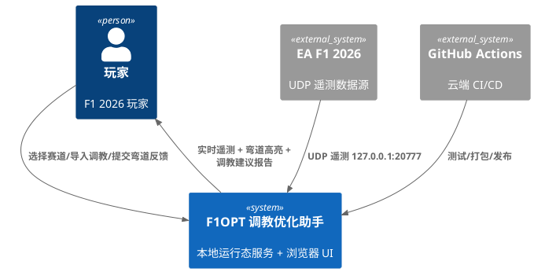

# F1OPT 赛车调教优化助手 —— 需求规格说明书（EARS）

> 文档版本：v1.0
> 文档状态：已生成（待评审确认）
> 需求格式：EARS（Easy Approach to Requirements Syntax）
> 适用对象：产品经理、测试工程师、业务干系人、后续设计/实现人员
> 特性标识：`setup-tuner`（setup 调教 + tuner 调优）

---

## 1. 组件定位

### 1.1 核心职责
本组件负责将 F1 游戏的**遥测客观数据**与玩家的**弯道主观反馈**结合，通过确定性规则引擎输出**整套（整体性）赛车调教建议**，实现"跑圈 → 反馈 → 建议 → 再跑"的闭环调教优化。

### 1.2 核心输入
| # | 输入 | 来源 | 内容概要 |
|---|------|------|----------|
| 1 | 游戏遥测数据包 | EA F1 2026 UDP（`127.0.0.1:20777`） | 赛道信息、Car Setups 调教包、Session 天气包、Car Status 轮胎包、LapData 圈速、扇区时间等 |
| 2 | 弯道主观反馈 | 玩家在可点击赛道图上的选项式操作 | 12 种症状（entry/apex/exit/global 四类）+ 强度 0–5（默认 3） |
| 3 | 赛道选择指令 | 玩家页面操作或自动识别 | 目标赛道标识 |
| 4 | 调教导入指令 | 玩家一键触发 | 当前游戏调教（来自 Car Setups 数据包） |

### 1.3 核心输出
| # | 输出 | 目标 | 内容概要 |
|---|------|------|----------|
| 1 | 实时遥测可视化 | 浏览器页面 | 实时遥测数值 + 当前第几弯高亮 |
| 2 | 调教建议报告 | 浏览器页面（可导出） | setupDelta、每参数联动说明、官方出处、置信度、取舍(tradeoff)提示 |
| 3 | 本地服务响应 | 浏览器前端 | HTTP/WebSocket 推送的遥测与建议数据 |

### 1.4 职责边界
本组件**不负责**以下事项：
1. **不负责**策略规划（进站策略、轮胎配方策略、ERS/燃料管理）——历史上曾讨论但本版本不做；
2. **不负责**赛事/赛季/冠军模拟（圈速仿真、排位/正赛模拟器、车手状态等）——这些属于已归档的 legacy 范畴；
3. **不负责**任何机器学习/大模型训练、预测或外部 AI API 调用；
4. **不负责**修改游戏本体（不写游戏内存、不注入任何进程），仅提供建议供玩家手动/游戏内调整；
5. **不负责**云端运行态服务，云端仅承担编写/测试/打包/发布（GitHub Actions）。

---

## 2. 系统目标

本系统的目标是让 EA Sports F1 2026 玩家无需专业赛车工程知识，即可通过"跑圈 → 反馈手感 → 获得整套调教建议 → 再跑验证"的闭环，逐步将赛车调教优化到符合个人驾驶偏好的状态。

**成功判定**：
1. 玩家完成初次跑圈后，能在 1 次交互内获得覆盖全部调教参数的整套建议（而非单点建议）；
2. 每一条调教建议均能追溯到官方出处（EA F1 2026 官方 UDP 规范 / 官方调教指南 / Pirelli 官方数据）；
3. 建议结果可复现：相同输入（赛道 + 调教 + 反馈）必然产出相同建议（纯确定性，零随机）。

---

## 3. 范围

### 3.1 范围内（In Scope）
- 本地服务启动、浏览器自动打开、一键部署；
- 赛道选择 / 自动识别；
- 调教一键导入（Car Setups 包解析）；
- UDP 遥测接收、实时显示、当前弯道高亮；
- 可点击赛道图上的选项式弯道反馈（12 项症状 × 强度 0–5）；
- 确定性"整体性规则引擎"（症状 → 诊断向量 Dx → 耦合矩阵 C → SetupDelta）；
- 调教建议报告输出（含出处、置信度、tradeoff）；
- 云端 CI/CD（GitHub Actions）与 Nuitka 原生打包。

### 3.2 范围外（Out of Scope）
- 机器学习 / 大模型 / 外部 AI API；
- 赛事策略、进站、轮胎策略、冠军模拟等 legacy 能力（归档不复用，若未来需要另行立项）；
- 游戏进程注入 / 内存修改 / 自动化调整游戏内调教；
- 多玩家协作、云端账号体系、远程数据同步。

---

## 4. 领域术语

**调教（Car Setup）**
: 赛车可调参数的集合，包含空力、差速器、悬挂几何、悬挂、刹车、轮胎等类别。对应 EA F1 2026 遥测中的 Car Setups 数据包。

**症状（Symptom）**
: 玩家对某个弯道体验到的、可选项式描述的问题，如转向不足、出弯打滑等。共 12 种，分为入弯(entry)、弯中(apex)、出弯(exit)、全局(global)四类。

**诊断向量（Diagnostic Vector, Dx）**
: 将症状映射为一组约 8 维的底层诊断维度（如"前轴抓地""后轴抓地""制动稳定性"等，外加"底盘离地"），每个维度以带符号数值表征问题方向与严重程度。

**耦合矩阵（Coupling Matrix, C）**
: 描述"每个调教参数对每个诊断维度的影响方向与强度"的矩阵，是实现"整体性调教"（一个反馈关联全部调教选项）的核心。

**调教增量（SetupDelta）**
: 规则引擎输出的、对每个调教参数的调整量，计算公式为 `SetupDelta = clamp(Dx × C)`，并受参数区间约束与单次调整上限限制。

**整体性规则引擎（Holistic Rule Engine）**
: 纯确定性的规则引擎，保证"一个反馈关联全部调教选项"，绝不"头痛医头"；无模型、无训练、无随机。

**遥测（Telemetry）**
: 游戏通过 UDP（默认 `127.0.0.1:20777`）对外广播的实时数据包流。

**置信度（Confidence）**
: 建议报告中对每条调教建议的可靠程度评估，由遥测证据充分度、反馈明确度等因素决定。

**取舍提示（Tradeoff）**
: 建议报告中对"该调整可能带来的副作用"（如提升前轴抓地可能牺牲直道极速）的说明。

---

## 5. 角色与边界

### 5.1 核心角色
- **玩家（F1 电竞玩家）**：运行工具、选择赛道、导入调教、跑圈、提交弯道反馈、阅读并采纳调教建议、在游戏内调整后再跑。
- **玩家（本地运行态维护者）**：双击一键启动脚本、确保游戏遥测端口开启。

### 5.2 外部系统
- **EA Sports F1 2026 游戏**：遥测数据源（UDP 广播），也是调教建议的最终应用环境。
- **GitHub Actions**：云端 CI/CD，承担代码编写后测试、Nuitka 打包、发布。
- **GitHub 发行页（Release）**：分发 zip 下载与单文件便携包。

### 5.3 交互上下文

---

## 6. 约束（硬约束，必须全部满足）

| # | 约束类别 | 约束内容 |
|---|----------|----------|
| C-01 | 语言 | 仅使用 Python 3.11（主实现）或 C（可选 C 扩展）。**禁止**使用其他任何语言。 |
| C-02 | 无 AI/ML | 去 LLM、去 ML：纯确定性规则引擎，**零模型、零训练、零外部 AI API**。 |
| C-03 | 调教整体性 | 一个反馈必须关联**全部调教选项**，通过"诊断向量 × 耦合矩阵"实现，绝非头痛医头。 |
| C-04 | 遥测范围 | 遥测数据覆盖范围必须包含：赛道信息、调教（Car Setups 包）、天气（Session 包 weather）、轮胎（Car Status 包 tyre）、圈速（LapData）、扇区时间。 |
| C-05 | 官方出处 | 所有数据/规则/阈值来源必须为 **EA F1 2026 官方**（官方 UDP 遥测规范、官方调教指南、Pirelli 官方数据）；**每条规则须标注官方出处**。 |
| C-06 | 拒绝复用旧 bug 代码 | 旧 `f1opt/` 代码归档为 `legacy/`，**禁止简单复用**；核心逻辑全部重写。 |
| C-07 | 全程云端 | 编写/测试/打包/发布全部走 GitHub Actions，测试直到无错误；本地仅保留运行态服务（收 UDP 遥测 + 开界面）。 |
| C-08 | 打包方式 | 使用 Nuitka 编译原生（**弃用 PyInstaller**），产出单文件/便携包。 |
| C-09 | 体验 | UI 设计良好、系统性能良好、方便使用。 |

---

## 7. 功能需求（FR）

> 需求编号规则：`FR-<模块>-<序号>`。每条需求标注 EARS 类型与（如适用）官方出处。
> EARS 类型：U=普遍(Ubiquitous)、E=事件驱动(Event)、S=状态驱动(State)、W=异常(Unwanted)、O=可选(Optional)。

### 7.1 部署与启动

- **FR-DEP-01** [U] 系统应支持从 GitHub Release 下载 zip 后解压到本地（如 D 盘）直接可用。
  - 验收条件：解压目录内双击「一键启动」脚本即可启动，无需额外安装依赖（便携包）或按 README 一键装依赖。

- **FR-DEP-02** [E] 当玩家双击「一键启动」脚本时，系统应：① 启动本地服务（监听 UDP 遥测 + 提供 HTTP/WebSocket）；② 自动打开默认浏览器并加载操作界面。
  - 验收条件：脚本执行后浏览器出现主界面，且服务进程存活。

- **FR-DEP-03** [W] 如果启动时检测到遥测端口 `20777` 被占用，则系统应提示玩家释放端口或切换端口，而非静默失败。
  - 验收条件：端口占用时给出明确提示。

- **FR-DEP-04** [W] 如果启动时发现依赖缺失（非便携包场景），则系统应给出清晰的一键安装指引，不允许崩溃退出。

### 7.2 赛道选择与识别

- **FR-TRK-01** [U] 系统应提供赛道选择能力，玩家可手动选择目标赛道。
- **FR-TRK-02** [U] 系统应支持**自动识别**游戏当前赛道（优先级高于手动选择）。
- **FR-TRK-03** [E] 当收到遥测中的赛道信息包时，系统应判定当前赛道；若与玩家手动选择冲突，应明确提示并以实际遥测赛道为准。
  - 官方出处：EA F1 2026 官方 UDP 遥测规范（赛道信息字段）。

- **FR-TRK-04** [U] 系统应为各赛道维护可点击的赛道图（弯道编号与位置）。
  - 官方出处：赛道布局来源于 EA F1 2026 官方赛道数据/官方调教指南。

### 7.3 调教导入

- **FR-SET-01** [E] 当玩家触发「一键导入调教」时，系统应解析遥测中的 **Car Setups 数据包**，还原当前游戏的完整调教（对应第 7.9 节全参数集）。
  - 官方出处：EA F1 2026 官方 UDP 遥测规范（Car Setups 包）。
- **FR-SET-02** [U] 系统应展示导入后的调教参数快照，供玩家核对。
- **FR-SET-03** [W] 如果调教导入时尚未收到 Car Setups 包（遥测未连接或包缺失），则系统应提示玩家先连接遥测，并禁止进入后续建议流程。

### 7.4 遥测接收与实时显示

- **FR-TEL-01** [U] 系统应持续接收来自 `127.0.0.1:20777` 的 UDP 遥测。
- **FR-TEL-02** [U] 系统应解析并覆盖以下数据包：赛道信息、调教（Car Setups）、天气（Session 包 weather）、轮胎（Car Status 包 tyre）、圈速（LapData）、扇区时间。
  - 官方出处：EA F1 2026 官方 UDP 遥测规范（对应各包结构）。
- **FR-TEL-03** [S] 当处于"跑圈中"状态时，系统应实时在页面显示遥测数值，并**高亮「当前第几弯」**（含当前扇区）。
- **FR-TEL-04** [W] 如果遥测数据出现丢包/乱序，则系统应对可恢复字段做容错（如保持上一有效值），并对异常做记录，不导致画面崩溃。

### 7.5 弯道主观反馈

- **FR-FBK-01** [E] 当玩家在可点击赛道图上**点击某个弯道**时，系统应进入该弯道的反馈录入；**未点击的弯道默认视为"正常"**。
- **FR-FBK-02** [U] 系统应支持如下 12 项症状，按四类组织（已定稿，逐字保留）：

| 类别 | 症状标识 | 症状名称 |
|------|----------|----------|
| 入弯 entry | `understeer` | 转向不足 |
| 入弯 entry | `oversteer` | 转向过度 |
| 入弯 entry | `turnin_unresponsive` | 转向不灵敏 |
| 入弯 entry | `brake_long` | 刹车距离长 |
| 入弯 entry | `lockup` | 轮胎易锁死 |
| 弯中 apex | `midcorner_unstable` | 车身不稳定 |
| 弯中 apex | `midcorner_traction` | 弯中不能稳定加速 |
| 出弯 exit | `exit_wheelspin` | 出弯打滑 |
| 全局 global | `bottoming` | 直道刮底 |
| 全局 global | `tyre_wear` | 胎耗偏高（注意：是胎耗，非胎温） |
| 全局 global | `straight_slow` | 直道速度低 |
| 全局 global | `lap_slow` | 圈速不高 |

- **FR-FBK-03** [U] 系统应允许为每个症状选择强度 0–5，默认值为 3。
- **FR-FBK-04** [W] 如果玩家未点击任何弯道直接请求建议，则系统应提示"未发现反馈"，并给出引导（至少需 1 条有效反馈或选择"全局"症状）。

### 7.6 整体性规则引擎（分析模型）

- **FR-ENG-01** [U] 系统应采用事件分层的三阶段分析模型：

| 阶段 | 说明 |
|------|------|
| ① 症状（Symptom） | 上层的 12 种症状（玩家可感知） |
| ② 诊断向量 Dx | 将症状映射为约 8 维底层诊断向量：前轴抓地 / 后轴抓地 / 入弯响应 / 高速稳定性 / 制动稳定性 / 制动力 / 出弯牵引 / 轮胎寿命，另加"底盘离地" |
| ③ 耦合矩阵 C | 描述每个调教参数对每个诊断维度的影响方向与强度 |

- **FR-ENG-02** [U] 系统应计算 **SetupDelta = clamp(Dx × C)**，其中 `clamp` 施加：① 每个调教参数的合法区间约束；② 单次调整上限（防一次性过调）。
- **FR-ENG-03** [U] 系统应使用**遥测客观数据**校准调整幅度、印证调整方向。
  - 官方出处：EA F1 2026 官方 UDP 遥测规范 + 官方调教指南 + Pirelli 官方数据。
- **FR-ENG-04** [U] 系统必须保证：一个反馈会通过耦合矩阵关联**全部调教选项**（整体性），而非只改单一参数。
- **FR-ENG-05** [U] 系统必须为纯确定性：相同输入（赛道 + 调教 + 反馈）→ 相同输出，零随机、零模型、零外部 AI。

### 7.7 调教建议报告

- **FR-RPT-01** [U] 系统应输出建议报告，逐参数包含：① `setupDelta`（每个参数的调整量）；② 每参数联动说明；③ 官方出处；④ 置信度；⑤ 取舍(tradeoff)提示。
- **FR-RPT-02** [U] 系统应为每条建议标注官方出处（EA F1 2026 官方 UDP 规范 / 官方调教指南 / Pirelli 官方数据之一）。
- **FR-RPT-03** [U] 系统应给出建议的置信度（由遥测证据充分度、反馈明确度等决定）。
- **FR-RPT-04** [W] 如果某参数调整后可能引发副作用（tradeoff），则系统必须在报告中显式提示，而非静默。

### 7.8 迭代闭环

- **FR-ITER-01** [E] 当玩家采纳建议并在游戏内调整后再次跑圈时，系统应能重新导入调教、接收新反馈，进入新一轮建议，形成"再跑 → 再反馈 → 再建议"闭环。
- **FR-ITER-02** [U] 系统应支持历史反馈/建议的留存与对比，便于玩家感知调整前后的变化。

### 7.9 调教参数全集

- **FR-PARAM-01** [U] 系统必须覆盖以下调教参数全集，无遗漏：

| 类别 | 参数 |
|------|------|
| 空力 | 前翼、后翼、主动空力（Z 轴 / X 轴） |
| 差速器 | 加速(on-throttle)差速、减速(off-throttle)差速 |
| 悬挂几何 | 前外倾角、后外倾角、前束角、后束角 |
| 悬挂 | 前弹簧、后弹簧、前防倾杆、后防倾杆、前行驶高度、后行驶高度、阻尼 |
| 刹车 | 刹车压力、前后刹车配比 |
| 轮胎 | 前胎压、后胎压 |
| 2026 新增 | 发动机制动、配重(ballast) |

- **FR-PARAM-02** [U] 每个参数须维护：取值范围（下/上限）、默认值、单步增量、单次调整上限。
  - 官方出处：EA F1 2026 官方调教指南（各参数区间）。

### 7.10 技术栈约束需求

- **FR-TECH-01** [U] 系统应采用如下技术栈：

| 层次 | 技术 |
|------|------|
| 语言 | Python 3.11（主）+ C（可选扩展） |
| Web 后端 | FastAPI + uvicorn |
| 实时通信 | WebSocket |
| 持久化 | SQLite |
| UDP 解析 | Python `struct` |
| 前端 | 直出 HTML/JS（内嵌，无独立前端框架负担） |
| 打包 | Nuitka（弃 PyInstaller） |
| CI/CD | GitHub Actions（测试：ubuntu runner；打包：windows-latest runner） |

---

## 8. 非功能需求（NFR）

### 8.1 性能
- **FR-NFR-P1** [U] 遥测接收与实时显示应达到：常规带宽下（F1 2026 遥测<60Hz），页面刷新延迟低，UI 流畅无卡顿；系统应支持持续监听的性能目标（具体指标：核心接口/遥测处理在 ≤ 1 秒内响应，实时显示延迟目标由设计阶段细化，但不得影响"当前第几弯"高亮的实时性）。
- **FR-NFR-P2** [U] 单实例资源占用应优化（内存/CPU 目标由设计阶段量化并写入 design.md）。

### 8.2 可用性
- **FR-NFR-U1** [U] UI 设计良好、方便使用（一站式流程，符合第 7 节端到端流程）。
- **FR-NFR-U2** [U] 前端界面应为中文界面；关键操作应有明确反馈（成功/失败提示）。

### 8.3 UI/体验约束
- **FR-NFR-UI1** [E] 当遥测连接成功时，系统应在界面显示连接状态与实时数据；当连接断开时，应给出可见重连提示。

### 8.4 可靠性
- **FR-NFR-R1** [U] 建议结果可复现（确定性，见 FR-ENG-05）。
- **FR-NFR-R2** [W] 如果发生遥测丢包、数据缺失等异常，系统应降级提示而非崩溃（见 FR-TEL-04、FR-SET-03）。

### 8.5 安全性
- **FR-NFR-S1** [U] 系统不应修改游戏进程/内存；仅读取 UDP 遥测并输出建议。
- **FR-NFR-S2** [U] 本地数据（SQLite）不含敏感外部凭据；`.env` 仅含本地配置。

### 8.6 可维护性
- **FR-NFR-M1** [U] 所有规则必须可追溯（每条标注官方出处，贯穿文档与代码注释）。
- **FR-NFR-M2** [U] 核心逻辑全部重写，legacy 代码归档隔离（配合 C-06）。

---

## 9. 数据需求

| 数据对象 | 来源 | 关键字段/约束 |
|----------|------|---------------|
| 赛道信息 | 遥测 Track/赛道包 | 赛道 ID、名称、弯道数量 |
| Car Setups（调教） | 遥测 Car Setups 包 | 对应第 7.9 节全参数集 |
| Weather（天气） | Session 包 weather | 天气类型（干/湿等） |
| Tyre（轮胎） | Car Status 包 tyre | 胎温、胎压、胎耗相关（区分胎耗与胎温） |
| 圈速 | LapData | 当前圈、上一圈、最快圈 |
| 扇区时间 | LapData/Sector | 三扇区时间 |
| 玩家反馈 | 本地输入 + SQLite | 弯道编号、症状标识（12 项）、强度 0–5 |
| 诊断向量 Dx | 规则引擎中间结果 | 约 8 维 + 底盘离地 |
| 耦合矩阵 C | 规则/配置（带出处） | 参数 × 诊断维度的影响方向与强度 |
| 调教建议 | 规则引擎输出 + SQLite | setupDelta、联动说明、出处、置信度、tradeoff |

---

## 10. 验收标准（Acceptance Criteria）

1. **AC-01（端到端）**：从 GitHub Release 下载 zip、解压、双击「一键启动」后，本地服务启动且浏览器自动打开界面；页面能接收游戏遥测并实时显示，且能高亮「当前第几弯」。
2. **AC-02（反馈闭环）**：玩家点击赛道图中任一弯道，能录入 12 项症状中任意项并设强度 0–5（默认 3）；未点击弯道默认"正常"；能触发整体性规则引擎产生建议。
3. **AC-03（整体性 + 确定性）**：任一单点反馈（如"入弯转向不足"）产出的建议必须关联**全部调教选项**；且相同输入重复运行产出结果完全一致（零随机）。
4. **AC-04（官方出处可追溯）**：报告中的每一条调教建议都能定位到官方出处（EA F1 2026 官方 UDP 规范 / 官方调教指南 / Pirelli 官方数据之一）；所有规则类配置均有出处标注。
5. **AC-05（技术栈合规）**：系统仅用 Python 3.11/C 实现；无任何 LLM/ML/外部 AI 调用；打包产物为 Nuitka 编译原生（非 PyInstaller）；测试在 GitHub Actions 云端跑通（ubuntu 测试、windows-latest 打包）。

---

## 11. 需求条目统计

- 功能需求（FR）：**33 条**（DEP 4 + TRK 4 + SET 3 + TEL 4 + FBK 4 + ENG 5 + RPT 4 + ITER 2 + PARAM 2 + TECH 1）
- 非功能需求（NFR）：**11 条**（性能 2 + 可用性 2 + UI 1 + 可靠性 2 + 安全性 2 + 可维护性 2）
- 硬约束（C）：**9 条**
- 验收标准（AC）：**5 条**
- **需求条目总数：58 条**

---

*本文档由 spec-requirements-agent 生成，待用户评审确认后提交。*